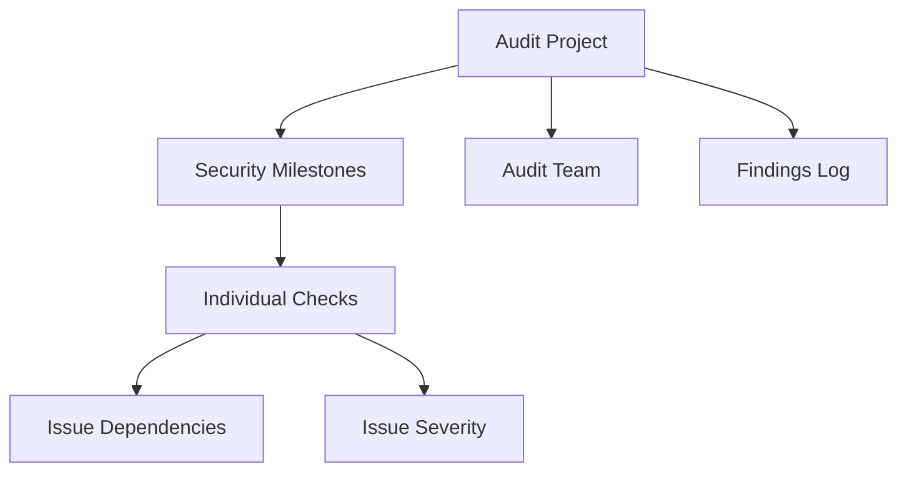

# Cairo Audit: Smart Contract Security Management

A decentralized platform for comprehensive smart contract auditing and security tracking, built on Stacks blockchain.

## Overview

Cairo Audit empowers security professionals and blockchain teams to:
- Conduct systematic and transparent smart contract audits
- Track audit progress and findings through an immutable on-chain record
- Manage security assessments with role-based access
- Collaborate efficiently with context-aware reporting
- Monitor audit lifecycles and critical security issues

## Architecture

Cairo Audit uses a structured, hierarchical approach to security assessments:



Core components:
- Audit Projects: Top-level containers for security assessments
- Security Milestones: Key phases of the audit process
- Individual Checks: Specific security verifications
- Audit Team: Specialized members with defined roles
- Findings Log: Comprehensive record of discovered issues

## Contract Documentation

### Main Contract: audit-manager.clar

#### Status Constants
- `STATUS-PENDING` (1): Initial audit state
- `STATUS-IN-PROGRESS` (2): Audit actively being conducted
- `STATUS-COMPLETED` (3): Audit successfully finalized
- `STATUS-DELAYED` (4): Audit experiencing setbacks
- `STATUS-CANCELLED` (5): Audit prematurely terminated

#### Role Constants
- `ROLE-LEAD-AUDITOR` (1): Primary audit coordinator
- `ROLE-SECURITY-ANALYST` (2): Technical audit contributor
- `ROLE-OBSERVER` (3): Limited access reviewer

## Getting Started

### Prerequisites
- Clarinet installed
- Stacks wallet for deployment/interaction
- Smart contract source code for audit

### Usage Examples

1. Create a new audit project:
```clarity
(contract-call? .audit-manager create-project 
    "Cairo Smart Contract Audit" 
    "Comprehensive security assessment" 
    u1000)
```

2. Add security team member:
```clarity
(contract-call? .audit-manager add-team-member 
    u1 
    'ST1PQHQKV0RJXZFY1DGX8MNSNYVE3VGZJSRTPGZGM 
    u2)
```

3. Create audit milestone:
```clarity
(contract-call? .audit-manager create-milestone 
    u1 
    "Static Analysis" 
    "Code review and vulnerability scanning" 
    u500)
```

## Function Reference

### Audit Project Management

```clarity
(create-project (name (string-ascii 100)) (description (string-utf8 500)) (deadline uint))
(add-team-member (project-id uint) (member principal) (role uint))
(create-milestone (project-id uint) (name (string-ascii 100)) (description (string-utf8 500)) (deadline uint))
```

### Security Assessment Management

```clarity
(create-audit-check (project-id uint) (milestone-id uint) (name (string-ascii 100)) (description (string-utf8 500)) (deadline uint) (dependencies (list 10 uint)))
(assign-check (project-id uint) (milestone-id uint) (check-id uint) (assignee principal))
(update-check-status (project-id uint) (milestone-id uint) (check-id uint) (new-status uint))
```

### Query Functions

```clarity
(get-project (project-id uint))
(get-milestone (project-id uint) (milestone-id uint))
(get-audit-check (project-id uint) (milestone-id uint) (check-id uint))
(get-checks-by-assignee (project-id uint) (assignee principal))
(get-upcoming-audit-deadlines (project-id uint) (blocks-window uint))
```

## Development

### Testing
1. Clone the repository
2. Install dependencies: `clarinet install`
3. Run tests: `clarinet test`

### Local Development
1. Start local chain: `clarinet console`
2. Deploy contract
3. Interact using clarity console

## Security Considerations

1. Access Control
- Strict role-based permissions for audit team members
- Lead auditor controls critical project actions
- Granular access management to protect sensitive findings

2. Data Validation
- Deadline constraints prevent stale audits
- Rigorous status transition validation
- Dependency tracking ensures comprehensive coverage
- Cryptographic proof of audit integrity

3. Audit Constraints
- Maximum 10 inter-check dependencies
- Strict naming and description length limits
- Scalable design for complex smart contract assessments

4. Compliance & Transparency
- Immutable on-chain audit record
- Verifiable audit trail
- Supports multi-sig confirmations for critical decisions